# Proyecto Data Lovers 💻

## Temática: League of legends 🎮

### Resumen del proyecto 👁‍🗨

El proyecto consiste en armar una web que permita al **jugador(a) experto(a)** poder escoger un(a) campeón(a) segun diversos filtros (ordenar alfabéticamente, mejor armadura por nivel, por rol, por nombre) para formar su equipo de juego.

## Trabajo UX

### **Historias de usuario** 📝

### _Usuarios_ 🎯

Jugadores de League of Legends nivel expert.

### _Desarrollo_ 🔨

En este proyecto implementamos 9 historias de usuario:

- Login
- Ver el nombre del usuario
- Visualizar todos los campeones
- Escoger por el rol de cada campeón
- Escoger por mejor ganancia de armadura por nivel
- Ordenar alfabeticamente de la A a la Z y viceversa
- Mostrar la información mas detallada de cada campeón en el reverso de cada tarjeta
- Mostrar en el anverso de cada tarjeta el rol y el nombre
- Buscar un personaje

## Prototipos de baja 📸

#### WEB 💻

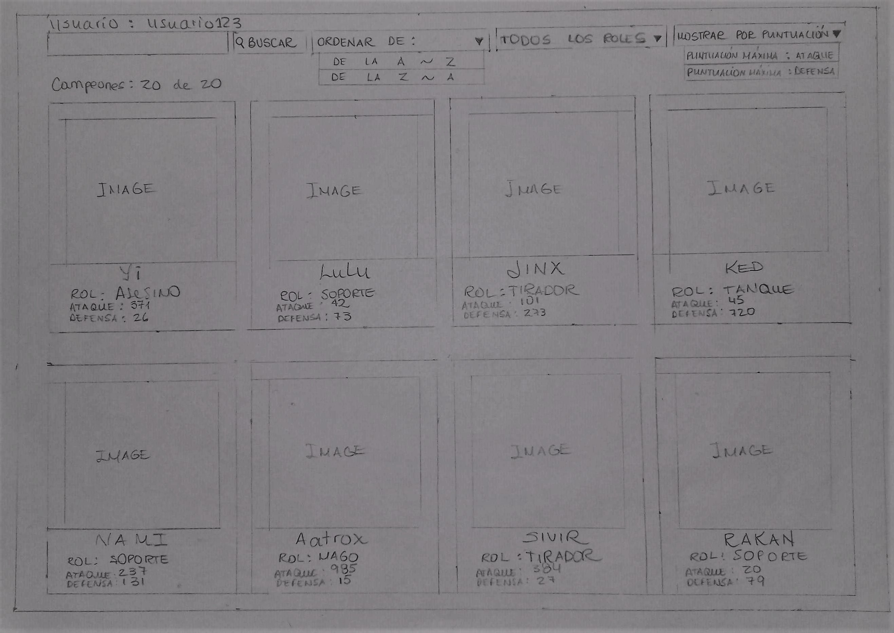
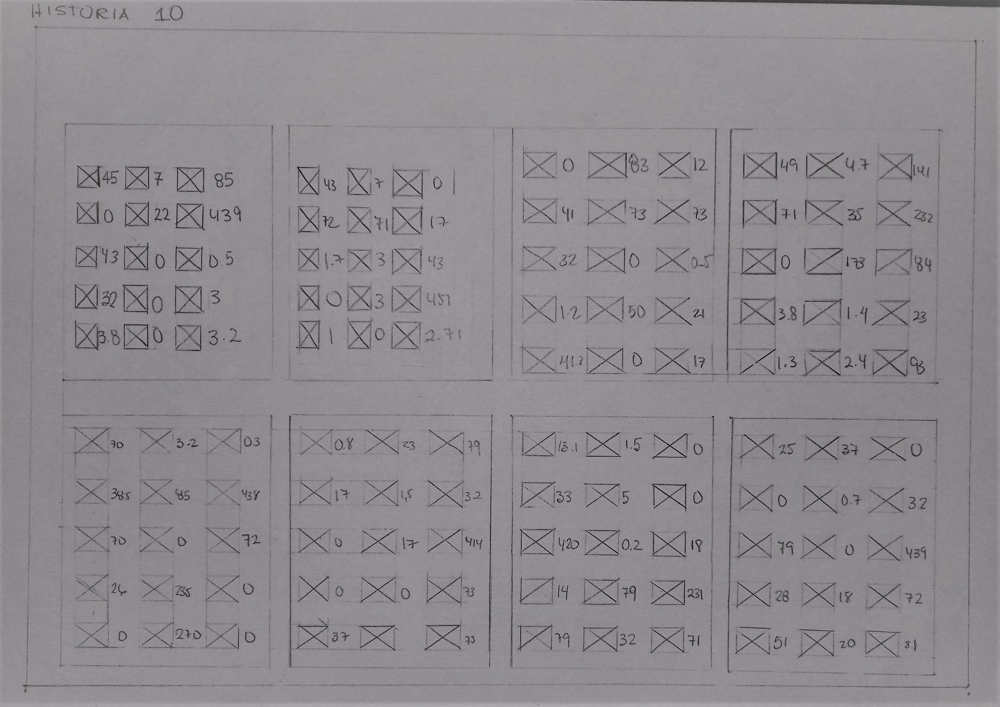

#### Movile 📱

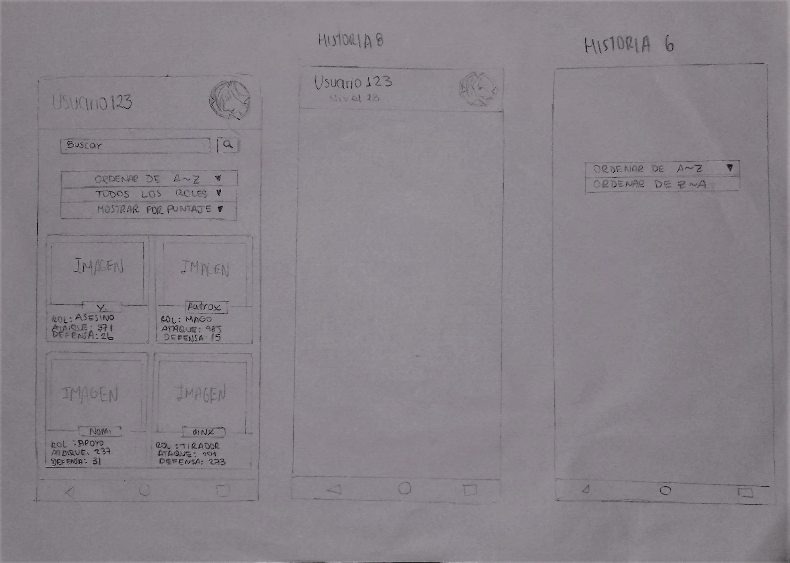

### _Testing con usuarios reales_ 👩

- Usuario 1: Sugirio cambiar los iconos de los items para que resalten mas ,seguido de los puntajes del campeon
- Usuario 2: Sugirio mejorar la visibilidad de los puntajes de cada campeon
- Usuario 3: Sugirio cambiar el tamaño de la letra

### _Feedback recibido_ 💪
-Guadalupe: Los bordes de las tarjetas deben ser mas suavizados.
-Katerin: Deberian añadirle un botón que redirija a la página de League of Legends.
## _Prototipos de alta_ 📪

#### WEB 💻

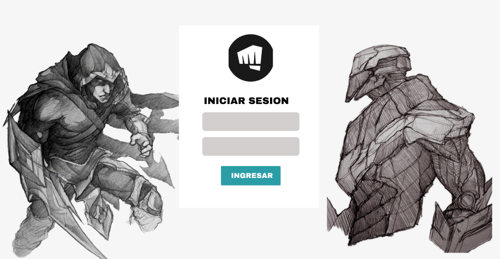
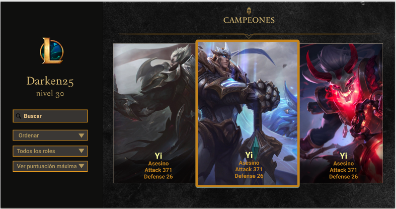
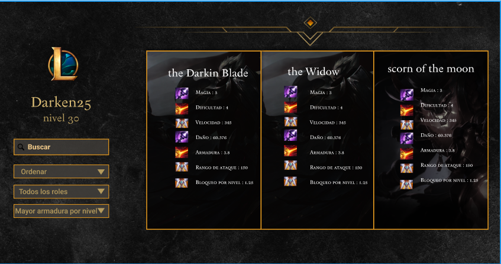

#### Movile 📱

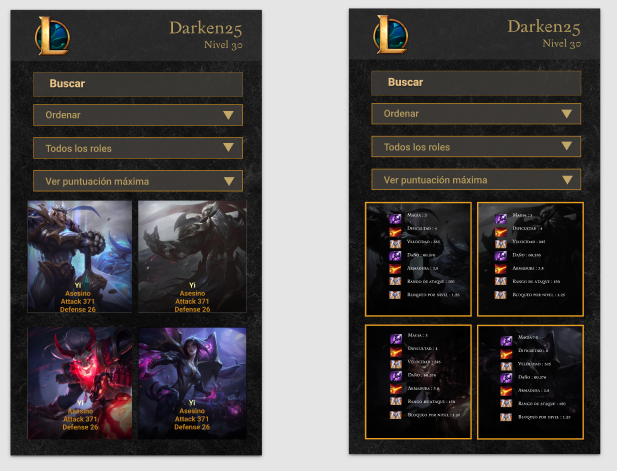

### _Testing con usuarios reales_ 👩 🧑
Usuario 1: Sugirio cambiar los iconos de los items para que resalten mas ,seguido de los puntajes del campeon
Usuario 2: Sugirio mejorar la visibilidad de los puntajes de cada campeon
Usuario 3: Sugirio cambiar el tamaño de la letra
### _Feedback recibido_ 💪
-Guadalupe: Los bordes de las tarjetas deben ser mas suavizados. -Katerin: Deberian añadirle un botón que redirija a la página de League of Legends.
## Proyecto finalizado 📦

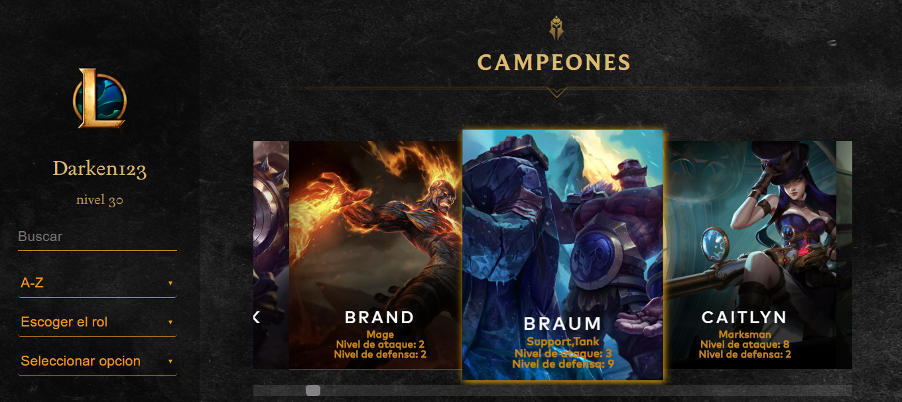
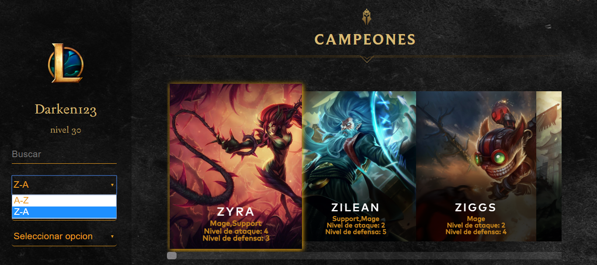
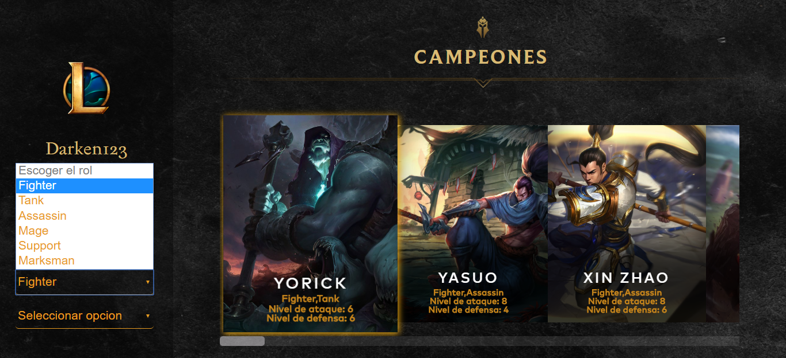
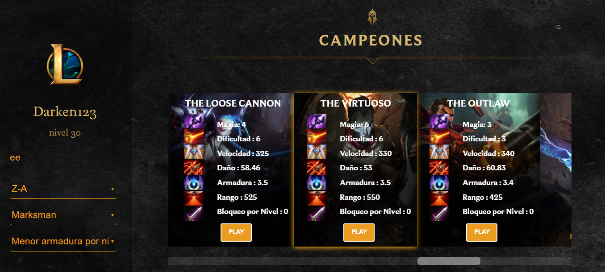
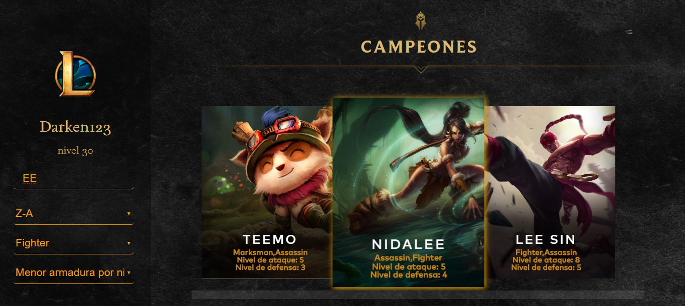
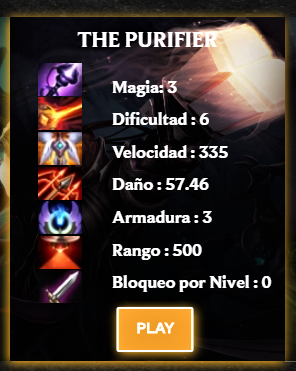
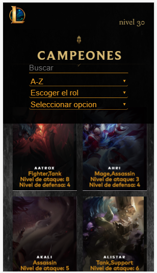

## _Checklist_ 📋

✅ Usa VanillaJS.

✅No hace uso de this.

✅Pasa linter (npm run pretest)

✅Pasa tests (npm test)

✅ Pruebas unitarias cubren un mínimo del 70% de statements, functions y lines y branches.

✅ Incluye Definición del producto clara e informativa en README.md.

✅ Incluye historias de usuario en README.md.

✅ Incluye sketch de la solución (prototipo de baja fidelidad) en README.md.

✅ Incluye Diseño de la Interfaz de Usuario (prototipo de alta fidelidad) en README.md.

❌ Incluye link a Zeplin en README.md.

✅ Incluye el listado de problemas que detectaste a través de tests de usabilidad en el README.md.

❌ UI: Muestra lista y/o tabla con datos y/o indicadores.

✅ UI: Permite ordenar data por uno o más campos (asc y desc).

✅ UI: Permite filtrar data en base a una condición.

✅ UI: Es responsive.

## Objetivos de aprendizaje
### UX

- [x] Diseñar la aplicación pensando y entendiendo al usuario.
- [x] Crear prototipos para obtener _feedback_ e iterar.
- [x] Aplicar los principios de diseño visual (contraste, alineación, jerarquía).
- [x] Planear y ejecutar _tests_ de usabilidad.

### HTML y CSS

- [x] Entender y reconocer por qué es importante el HTML semántico.
- [x] Identificar y entender tipos de selectores en CSS.
- [  ] Entender como funciona `flexbox` en CSS.
- [x] Construir tu aplicación respetando el diseño planeado (maquetación).

### DOM

- [x] Entender y reconocer los selectores del DOM (`querySelector` | `querySelectorAll`).
- [x] Manejar eventos del DOM. (`addEventListener`)
- [x] Manipular dinámicamente el DOM. (`createElement`, `appendchild`, `innerHTML`, `value`)

### Javascript

- [x] Manipular arrays (`filter` | `map` | `sort` | `reduce`).
- [x] Manipular objects (key | value).
- [x] Entender el uso de condicionales (`if-else` | `switch`).
- [x] Entender el uso de bucles (`for` | `forEach`).
- [x] Entender la diferencia entre expression y statements.
- [x] Utilizar funciones (`parámetros` | `argumentos` | `valor de retorno`).
- [x] Entender la diferencia entre tipos de datos atómicos y estructurados.
- [x] Utilizar ES Modules (`import` | `export`).

### Pruebas Unitarias (_testing_)
- [x] Testear funciones (funciones puras).

### Git y GitHub
- [x] Ejecutar comandos de git (`add` | `commit` | `pull` | `status` | `push`).
- [x] Utilizar los repositorios de GitHub (`clone` | `fork` | `gh-pages`).
- [x] Colaborar en Github (`pull requests`).

### Buenas prácticas de desarrollo
- [ ] Organizar y dividir el código en módulos (Modularización).
- [x] Utilizar identificadores descriptivos (Nomenclatura | Semántica).
- [x] Utilizar linter para seguir buenas prácticas (ESLINT).

